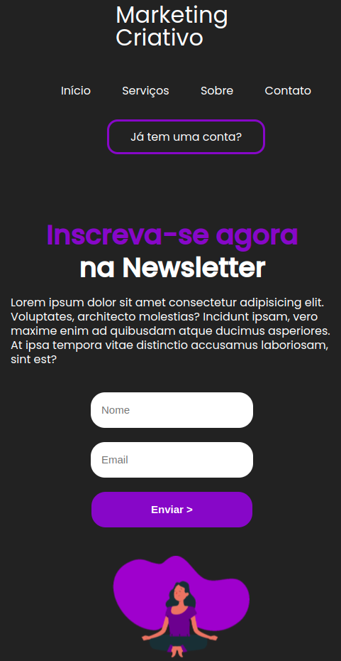

# Landing Page

​

​

> Projeto de landing page com HTML e CSS baseado na vídeo aula do *desenvolvedor Full Stack* **[Alexandre Santos](https://github.com/alexandresaints)**, abordando temas como: tags semânticas do HTML, responsividade, flexbox, entre outras dicas. Ideal para quem está se aventurando no desenvolvimento Front-end, assim como eu.

​

### Ajustes e melhorias
Do projeto original, modifiquei apenas algumas dimensões dos inputs e acrescentei a imagem ao formato mobile.

### Link da aula:
[Landing Page com HTML e CSS](https://youtu.be/edDCEK5QWE8)

